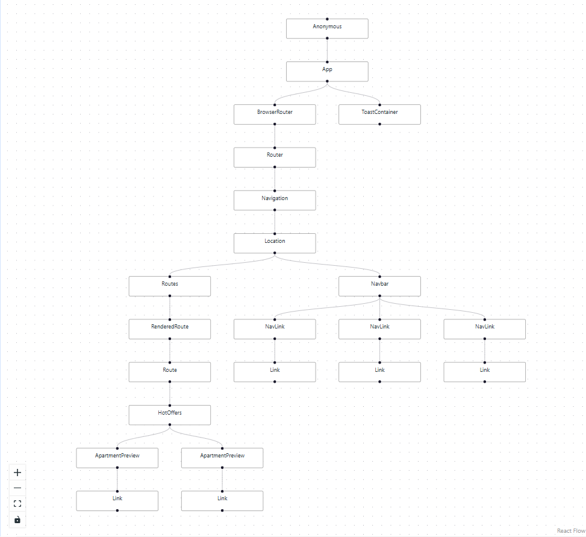
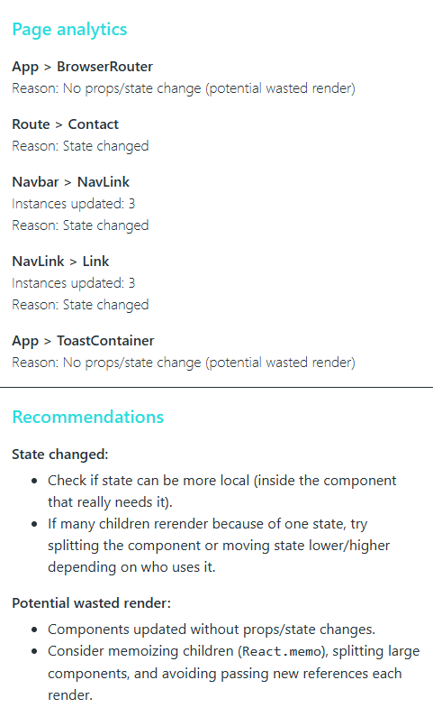

# ReactDetective

ReactDetective is a Chrome DevTools extension for real-time analysis of React application rendering behavior.

It visualizes the React component tree as an interactive graph and explains why components rerender, helping developers quickly identify performance issues and optimization opportunities.

---

## ✨ Features

- Interactive 2D visualization of the React component tree
- Real-time rerender tracking
- Highlighting updated components on each commit
- Automatic rerender reason detection:
  - props changes
  - state changes
  - potential wasted renders
- Analytics panel with per-update statistics
- Optimization recommendations
- Integrated directly into Chrome DevTools

---

## 🧠 Motivation

Modern React applications often suffer from unnecessary rerenders and complex component dependencies.  
Existing tools usually show component updates as lists or snapshots, which makes understanding runtime behavior difficult.

ReactDetective focuses on:

- visual understanding of component relationships
- explaining _why_ rerenders happen
- reducing debugging and optimization time

The tool combines React Fiber data with graph visualization to provide a clearer mental model of application behavior.

---

## 🏗 Architecture Overview

ReactDetective is implemented as a Chrome Extension (Manifest V3) consisting of:

- **Injected page hook**
  - connects to React DevTools global hook
  - collects Fiber tree and update data

- **Content script**
  - bridges page context and extension runtime

- **Background service worker**
  - message routing and synchronization

- **DevTools panel (React app)**
  - graph visualization
  - analytics and recommendations UI

All processing is performed locally in the browser. No external services or data collection are used.

---

## 📁 Project Structure

```text
react-detective/
│
├── panel-app/ # React DevTools panel application
│ ├── src/
│ │ ├── components/ # UI components (panel views)
│ │ ├── store/ # Redux Toolkit store and slices
│ │ ├── utils/ # Graph and flow utilities
│ │ ├── shared/ # Shared types and constants
│ │ └── hooks/ # Custom React hooks (panel bridge)
│ │
│ ├── tests/ # Jest tests
│ └── vite.config.ts # Vite build configuration
│
├── panel-dist/ # Built DevTools panel (generated)
│
├── background.js # Extension service worker
├── content-script.js # Page ↔ extension bridge
├── page-hook.js # React DevTools hook integration
├── devtools.js # DevTools panel registration
├── devtools.html # DevTools entry point
│
├── shared/ # Shared event types
├── images/ # Extension icons
│
├── .github/workflows/ # GitHub Actions CI/CD
│ └── ci.yml
│
└── manifest.json # Chrome extension manifest
```

---

## 🧰 Tech Stack

- React
- TypeScript
- Redux Toolkit
- Chrome Extension API (Manifest V3)
- React Flow (@xyflow/react)
- Dagre (graph layout)
- Vite
- Jest
- GitHub Actions (CI/CD)

---

## ⚙️ Installation (Development)

Clone the repository:

```bash
git clone https://github.com/YOUR_USERNAME/react-detective.git
cd react-detective
```

Install dependencies:

```bash
cd panel-app
npm install
```

Build the DevTools panel:

```bash
npm run build
```

Load extension in Chrome:

1. Open chrome://extensions
2. Enable Developer mode
3. Click Load unpacked
4. Select the project root folder

---

## 🧪 Testing

Run tests inside the panel application:

```bash
cd panel-app
npm test
```

---

## 🚀 CI / CD

GitHub Actions pipeline automatically:

- installs dependencies
- runs tests
- builds the panel application
- prepares extension package
- creates a zip archive for distribution (on version tags)
- To create a release build:

```bash
git tag v1.0.1
git push origin v1.0.1
```

---

## 📸 Screenshots

#### Component Tree Visualization:



#### Analytics Panel:



---

## ⚠️ Limitations (MVP)

- Works only with React applications exposing the DevTools hook
- No historical data storage (session-based analysis)
- Performance may decrease on very large component trees
- Rerender analysis is heuristic-based

---

## 🔮 Future Improvements

- Mini-map for large trees
- Advanced rerender analysis
- Export graphs (SVG / JSON)
- Learning mode for junior developers
- Performance sampling mode
